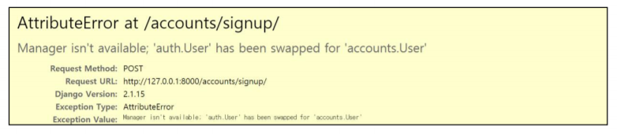

# 14_HomeWork

### 1. M:N True or False 

- 각 문항을 읽고 맞으면 T, 틀리면 F를 작성하고 틀렸다면 그 이유도 함께 작성하시오. 

  1) Django에서 1:N 관계는 ForeignKeyField를 사용하고 M:N 관계는 ManyToManyField를 사용한다. 

  - `True`

  2) ManyToManyField를 설정하고 만들어지는 테이블 이름은 “앱이름_클래스이름_지정한 필드이름”의 형태로 만들어진다.

  - `True`

  3) ManyToManyField의 첫번째 인자는 참조할 모델, 두번째 인자는 related_name이 작성 되는데 두 가지 모두 필수적으로 들어가야 한다.

  - `False`
  - related_name은 optional 인자이다.


### 2. Like in templates

- 아래 빈 칸 (a)와 (b)에 들어갈 코드를 각각 작성하시오.

  ```python
  class Article(models.Model):
      ...
      user = models.ForeighKey(settings.AUTH_USER_MODEL, on_delete=models.CASCADE)
      like_users = models.ManyToManyField(settings.AUTH_USER_MODEL, related_name='like_articles')
  ```

  ```django
  <!-- articles/index.html -->
  
  
    ...
    <p>{{ article.title }}</p>
    <a href="">
  	
        <i class="fas fa-heart fa-lg" style-"color:crimson"></i>
      
        <i class="fas fa-heart fa-lg" style-"color:black"></i>
      
    </a>
    <span>{{ article.like_users.all|length }}명이 이 글을 좋아합니다.</span>
  
  ```


### 3. Follow in views 

- 모델 정보가 다음과 같을 때 빈칸 (a)와 (b)에 들어갈 코드를 각각 작성하시오.

  ```python
  from django.db import models
  from django.conf import settings
  from django.contrib.auth.models import AbstractUser
  
  class User(AbstractUser):
      followers = models.ManyToManyField('self', symmetrical=False, related_name='followings')
  ```

  ```python
  app_name = "accounts"
  urlpatterns = [
      ...
      path('<int:user_pk>/follow/', views.follow, name="follow")
  ]
  ```

  ```python
  from django.contrib.auth import get_user_model
  
  
  User = get_user_model()
  
  @require_POST
  def follow(request, user_pk):
      person = get_object_or_404(User, pk=user_pk)
      user = request.user
      
      if user != person:
          if person.followers.filter(pk=user.pk).exists():
              person.followers.remove(user)
          else:
              person.followers.add(user)
      return redirect('accounts:profile', person.username)
  ```


### 4. User AttributeError 

- 아래와 같은 에러 메시지가 발생하는 이유와 이를 해결하기 위한 방법과 코드를 작성하 시오. 

  
  
  - 이유 :  settings의 AUTH_USER_MODEL이 accounts의 User로 수정 되었는데, /accounts/signup/ 요청(POST방식)에 대응하는 view 함수에서 기존의 auth.User를 참조하기 때문
  
  - 해결 방법 : /accounts/signup/ 요청에 대응하는 view 함수에서 auth.User를 참조하는 변수를 settings의 AUTH_USER_MODEL을 참조하도록 수정한다.
  
  - 코드 
  
    ```python
    from django.contib.auth import get_user_model
    
    User = get_user_model()
    ```
  
  - 아마도
  
    - view 함수에서 django에서 기본으로 제공하는 UserCreationForm 클래스를 사용해서 발생한 문제인 것 같다.
  
    - UsercreationForm은 auth.User를 사용하기 때문에 이 클래스를 상속받는 Custom 클래스를 만들면 된다.
  
    - ```python
      from django.contrib.auth.forms import UserCreationForm
      from django.contrib.auth import get_user_model
      
      class CustomUsercreationForm(UserCreationForm):
          
          class Meta:
              model = get_user_model()
              ...
      ```


### 5. related_name 

- 아래의 경우 related_name을 필수적으로 설정해야 한다. 그 이유를 설명하시오. 

  ```python
  class Article(models.Model):
  	user = models.ForeighKey(settings.AUTH_USER_MODEL, on_delete=models.CASCADE)
      like_users = models.ManyToManyField(settings.AUTH_USER_MODEL, related_name='like_articles')
  ```

  - Article과 User의 관계가 2개이다.
  - User 입장에서는 related manager가 2개인데, related_name을 따로 설정해주지 않으면, 이 manager의 이름(article_set)이 같아지기 때문에  충돌이 발생하는 에러가 발생한다.
  - ManyToManyField의 related_name을 'like_articles'로 수정하면 User는 'article_set'과, 'like_articles'를 사용할 수 있다.


### 6. follow templates person 

- 변수에는 view함수에서 넘어온 유저 정보가 담겨 있고, 모델 정보가 아래와 같을 때 빈칸 a, b, c, d, e에 들어갈 알맞은 코드를 각각 작성하시오

  ```python
  app_name = 'accounts'
  urlpatterns = [
      ...
      path('<str:username>/follow/', views.follow, name="follow")
  ]
  ```

  ```python
  from django.db import models
  from django.contrib.auth.models import AbstractUser
  
  class User(AbstractUser):
      followers = modles.ManyToManyField('self', symmetrical=False, related_name='followings')
  ```

  ```django
  <h1>작성자 : {{ person.username }}</h1>
  
  <div>팔로잉 : {{ person.followings.all|length }}</div>
  <div>팔로워 : {{ person.followers.all|length }}</div>
  
  <div>    
    
      
        <a href="">Unfollow</a>
      
        <a href="">follow</a>
      
    
  </div>
  
  ```

  


