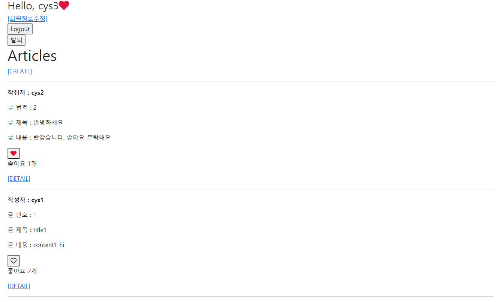

# 14 WorkShop


## Django Project

##### 데이터베이스 M:N 관계를 활용해 좋아요 기능 구현


### 1. Model

##### 좋아요 기능을 위한 컬럼 추가

```python
# articles/models.py
from django.db import models
from django.conf import settings


class Article(models.Model):
    user = models.ForeignKey(settings.AUTH_USER_MODEL, on_delete=models.CASCADE)
    like_users = models.ManyToManyField(settings.AUTH_USER_MODEL, related_name='like_articles')
    ...
```


### 2. url & view

##### /articles/<article_pk>/like/

- 로그인한 유저의 요청만 처리

```python
# articles/urls.py
from django.urls import path
from . import views

app_name = 'articles'
urlpatterns = [
	...
    path('<int:article_pk>/like/', views.like, name='like'),
]

#########################################################################################

# articles/views.py
from django.views.decorators.http import require_POST
from django.shortcuts import redirect, get_object_or_404
from .models import Article

@require_POST
def like(request, article_pk):
    if request.user.is_authenticated:
        article = get_object_or_404(Article, pk=article_pk)
        if article.like_users.filter(pk=request.user.pk).exists():
            article.like_users.remove(request.user)
        else:
            article.like_users.add(request.user)
        return redirect('articles:index')
    return redirect('accounts:login')
```


### 3. Template

##### font-awesome에서 로고 선택

- 개인 kit 발급 받은 후 base.html에 붙여 넣는다. (CDN)
- 좋아요에 활용할 로고 선택
- index.html에 좋아요 여부에 따른 결과를 보여준다.
  - 좋아요를 누른 경우 빨간색 하트, 그렇지 않은 경우 검은색 하트가 나타나도록 한다.
- 특정 글의 좋아요를 누른 전체 인원수를 출력한다.


### 결과 사진

