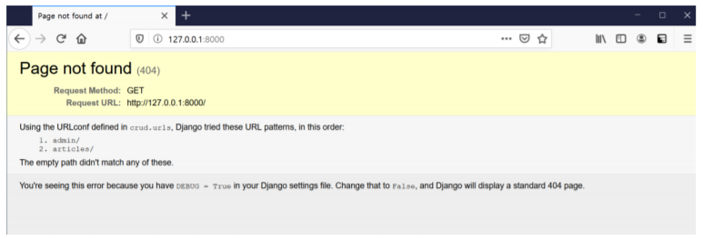

# 15_HomeWork

### 1. MTV 

- Django는 MTV로 이루어진 Web Framework다. MTV가 무엇의 약자이며 Django에서 각각 어떤 역할을 하고 있는지 작성하시오

  | 이름     | 역할              |
  | -------- | ----------------- |
  | Model    | 데이터베이스 관리 |
  | Tamplate | 인터페이스, 화면  |
  | View     | 중심 컨트롤러     |
  
  - Model 
    - 응용 프로그램의 데이터 구조를 정의하고 데이터베이스의 기록을 관리(추가, 수정, 삭제)
  - Template
    - 파일의 구조나 레이아웃을 정의
    - 실제 내용을 보여주는데 사용(presentation)
  - View - 요청에 대한 적절한 기능을 수행
    - HTTP 요청을 수신하고 HTTP 응답을 반환
    - Model을 통해 요청을 충족시키는데 필요한 데이터 접근
    - 그리고 템플릿에게 응답의 서식 설정을 맡김


### 2. 404 Page not found 

- 기본적으로 ‘/ ’ 페이지에 접속하게 되면 아래 사진처럼 Page not found 에러가 발생한다. ‘/ ’ 페이지에 접속했을 때 index.html를 렌더링 하고자 한다. 아래 빈칸에 알맞은 코드를 작성하시오. 

  (프로젝트의 이름은 crud 이며 app 이름은 articles이다. index.html 파일을 렌더링 하는 view 함수의 이름은 index라고 가정한다.)

  

  ```python
  from django.contrib import admin
  from django.urls import path, include
  from articles import views
  
  
  urlpatterns = [
      path('admin/', admin.site,urls),
      path('articles/', include('articles.urls')),
      path('', views.index, name='index'),
  ]
  ```


### 3. templates and static Django 

- 프로젝트는 기본적으로 render 할 html과 같은 template 파일과 css, js와 같은 static 파일을 앱 폴더 내부의 templates와 static 이름의 폴더에서 찾는다. 만약 해당 위치가 아닌 임의의 위치에 파일을 위치 시키고 싶으면 __(a)__ 파일의 __(b)__ 와 __(c)__ 라는 변수에 담긴 리스트의 요소를 정의하면 된다. 빈칸 (a), (b), (c)에 들어갈 내용을 작성하시오. 

  - (a) : settings.py
  - (b) : TEMPLATES
  - (c) : STATICFILES_DIRS


### 4. migration

- 아래는 그림과 같이 Django에서 선언한 Model을 Database에 반영하는 과정에서 사용하는 명령어에 대한 설명이다. 각 설명에 해당하는 명령어를 작성하시오. (app 이름은 articles이다.)

  ```python
  class Article(models.Model):
      title = models.CharField(max_length=100)
      content = modles.TextField()
      created_at = models.DateTimeField(auto_now_add=True)
      updated_at = models.DateTimeField(auto_now=True)
  ```

  1) 마이그레이션 생성 

  - ```bash
    $ python manage.py makemigrations
    ```

  2) 마이그레이션 DB 반영 여부 확인 

  - ```bash
    $ python manage.py showmigrations articles
    ```

  3) 마이그레이션에 대응되는 SQL문 출력 

  - ```bash
    $ python manage.py sqlmigrate articles <migration number>
    ```

  4) 마이그레이션 파일의 내용을 DB에 최종 반영

  - ```bash
    $ python manage.py migrate
    ```


### 5. ModelForm True or False 

- 각 문항을 읽고 맞으면 T, 틀리면 F를 작성하시오. 

  1) POST와 GET 방식은 의미론상의 차이이며 실제 동작 방식은 동일하다. 

  - **False**
  - ~~POST는 body, GET은 header에 데이터를 담는다..?~~
- 클라이언트가 서버로 요청을 보낼때 method의 값에 따라 요청 방식이 달라지므로 실제 동작 방식이 다르다고 할 수 있다.
  
2) ModelForm과 Form Class의 핵심 차이는 Model의 정보를 알고 있는지의 여부이다. 
  
- **Ture**
  
3) AuthenticationForm은 User 모델과 관련된 정보를 이미 알고 있는 ModelForm으로 구성되어 있다. 
  
  - **False**
- Form Class 상속
  
4) ModelForm을 사용할 때 Meta 클래스에 fields 관련 옵션은 반드시 작성해야 한다.
  
  - **True**
  
  - ModelForm을 직접 상속받아서 쓰는 경우 반드시 fileds 또는 exclude를 작성해야함
  
  - **False**

    - ModelForm을 상속받아서 작성된 클래스를 상속한 경우

    - 상속한 클래스의 Meta클래스의 fields를 그대로 사용할 수 있다..?

    - ex
  
    - ```python
      class CustomUserCreationForm(UserCreationForm):
      
          class Meta(UserCreationForm.Meta):
              model = get_user_model()
              # fields = UserCreationForm.Meta.fields
      		# fields를 작성하지 않아도, UserCreationForm.Meta에 작성된 fileds가 있기 때문에 괜찮은 듯..?
      ```


### 6. media 파일 경로 

- 사용자가 업로드한 파일이 저장되는 위치를 Django 프로젝트 폴더(crud) 내부의 /uploaded_files 폴더로 지정하고자 한다. 이 때, settings.py에 작성해야 하는 설정 2가지를 작성하시오.
  - ```python
    # 사용자가 업로드 한 파일을 보관할 디렉토리의 절대 파일 시스템 경로
    MEDIA_ROOT = BASE_DIR / 'crud' / 'uploaded_files'
    
    # MEDIA_ROOT에서 제공되는 미디어 파일을 처리하는 URL
    MEDIA_URL = '/media/'
    ```


### 7. DB True or False 

- 각 문항을 읽고 맞으면 T, 틀리면 F를 작성하시오. 

  1) RDBMS를 조작하기 위해서 SQL문을 사용한다. 

  - **True**

  2) SQL에서 명령어는 반드시 대문자로 작성해야 동작한다. 

  - **False**

  3) 일반적인 SQL문에서는 세미콜론( ; )까지를 하나의 명령어로 간주한다. 
  
  - **True**
  
  4) SQLite에서 .tables, .headers on과 같은 dot( . )로 시작하는 명령어는 SQL문이 아니다. 
  
  - **True**
  - dot으로 시작하는 명령어는 SQLite에서 쓰이는 명령어이다.
  
  5) 하나의 데이터베이스 안에는 반드시 한 개의 테이블만 존재해야 한다.
  
  - **False**


### 8. on_delete 

- 게시글과 댓글의 관계에서 댓글이 존재하는 게시글은 삭제할 수 없도록 즉, ProtectedError를 발생시켜 참조 된 객체의 삭제를 방지하는 __(a)__를 작성하시오.

  ```python
  class Article(models.Model):
      title = models.CharField(max_length=100)
      content = models.TextField()
      
  class Comment(models.Model):
      content = models.TextField()
      article = models.ForeignKey(Article, on_delete=models.__(a)__)
  ```

  - (a) : PROTECT


### 9. Like in models Article 

- 모델과 User 모델을 M:N 관계로 설정하여 ‘좋아요’ 기능을 구현하려고 한다. __(a)__와 __(b)__에 들어갈 내용을 작성하시오. 추가적으로 아래의 상황에서 __(b)__를 반드시 작성해야 하는 이유를 함께 작성하시오.

  ```python
  from django.db import models
  from django.conf import settings
  
  
  class Article(models.Model):
      content = models.TextField()
      user = models.ForeignKey(settings.AUTH_USER_MODEL, on_delete=models.CASCADE)
      loke_users = models.__(a)__(settings.AUTH_USER_MODEL, __(b)__='like_articles')
  ```

  - (a) : ManyToManyField
  - (b) : related_name
  - related_name을 따로 설정하지 않으면, 2개의 related manager 이름이 'article_set'가 되는데, 이 때 이름이 같기 때문에 충돌이 일어남


### 10. Follow in models follow 

- 기능을 구현하기 위해 accounts app의 models.py에 아래와 같은 모델을 작성하였다. Migration 작업 이후에 Database에 만들어지는 중개 테이블의 이름을 작성 하고 이 테이블의 id를 제외한 컬럼 이름을 각각 작성하시오.

  ```python
  from django.db import models
  from django.contrib.auth.models import AbstracUser
  
  
  class User(models.Model):
      followings = models.ManyToManyField('self', symmetrical=False, related_name='followers')
  ```

  - 중개 테이블 이름 : accounts_user_followings
  - 컬럼 이름 : from_user_id / to_user_id
