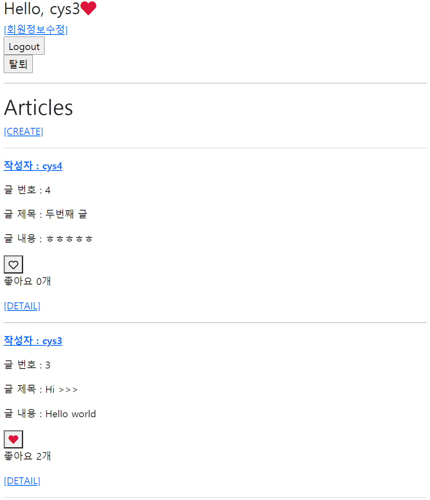

# 15 WorkShop


## Django Project

##### 데이터베이스 M:N 관계를 활용해 팔로우 기능 구현


### 1. Model

팔로우 기능을 위한 모델 세팅

팔로우 기능을 구현하기 위해 User 모델을 대체

```python
# accounts/models.py
from django.db import models
from django.contrib.auth.models import AbstractUser

class User(AbstractUser):
    followings = models.ManyToManyField(
        'self',
         symmetrical=False,
         related_name='followers')
```


### 2. url & view

/accounts/<username>/

유저 프로필 페이지 기능을 구현

- 로그인한 유저만 팔로우를 할 수 있다.


/aacounts/<username>/follow/

팔로우를 하기 위한 기능 구현

- 로그인한 유저만 팔로우를 할 수 있다.
- 본인은 팔로우 할 수 없다.

```python
# accounts/urls.py
from django.urls import path
from . import views

urlpatterns = [
    path('<str:username>/', views.profile, name='profile'),
    path('<str:username>/follow', views.follow, name='follow'),
]

#########################################################################################

# accounts/views.py
from django.views.decorators.http import require_POST
from django.shortcuts import redirect, get_object_or_404, render
from django.contrib.auth import get_user_model

# 유저 프로필 페이지 기능
@require_safe
def profile(request, username):
    user = get_object_or_404(get_user_model(), username=username)
    context = {
        'user':user,
    }
    return render(request, 'accounts/profile.html', context)

# 팔로우 기능
@require_POST
def follow(request, username):
    if request.user.is_authenticated:
        target_user = get_object_or_404(get_user_model(), username=username)
        if target_user != request.user:
            if target_user.followers.filter(pk=request.user.pk).exists():
                target_user.followers.remove(request.user)
            else:
                target_user.followers.add(request.user)
        return redirect('accounts:profile', username)
    return redirect('accounts:login')
```


### 3. Template

index.html의 username에 profile로 갈 수 있는 링크 설정

팔로잉 여부에 따라 팔로우와 언팔로우 버튼이 토글되도록 구성

- 로그인한 유저 자신의 프로필 페이지에서는 팔로우 & 언팔로우 버튼이 보이지 않는다.
- 작성자의 팔로잉, 팔로워 숫자를 보여주고 유저의 이름을 모두 출력한다.


### 결과 사진




