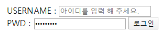
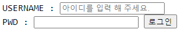

# 0202_HomeWork

### 1. Semantic Tag

- 보기 중 콘텐츠의 의미를 명확히 하기 위해 HTML5에서 새롭게 추가된 시맨틱(semantic) 태그를 모두 고르시오.

```plainText
div, header, h1, section, footer, a, form, span
```

​		**header, section, footer**


### 2. input Tag

- 아래 이미지와 같이 로그인 Form을 생성하는 HTML코드를 작성하시오. 단, USERNAME 글자를 클릭하면 아이디를 입력하는 input에, PWD 글자를 클릭하면 비밀번호를 입력하는 input에 focusing 되도록 하시오.



```html
<!DOCTYPE html>
<html lang="en">
<head>
  <meta charset="UTF-8">
  <meta name="viewport" content="width=device-width, initial-scale=1.0">
  <title>Document</title>
</head>
<body>
  <form action="#">
    <label for="username">USERNAME : </label>
    <input type="text" id="username" placeholder="아이디를 입력 해 주세요."
      name="username">
    <br>
    <label for="pwd">PWD : </label>
    <input type="password" id="pwd" name="pwd">
    <input type="submit" value="로그인">
  </form>
</body>
</html>
```




### 3. 크기 단위

- 크기 단위 em은 요소에 지정된 상속된 사이즈나 기본 사이즈에 대해 상대적인 사이즈를 설정한다. 즉, 상속의 영향으로 사이즈가 의도치 않게 변경될 수 있는데 이를 예방하기 위해 HTML 최상위 요소의 사이즈를 기준으로 삼는 크기 단위는 무엇인가?

  **rem**


### 4. 선택자

- 다음 예제를 통해 ‘자손 선택자’와 ‘자식 선택자’의 차이를 설명하시오.

```css
    /* 자손 선택자 */
    div p {
      color: crimson;
    }

    /* 자식 선택자 */
    div > p {
      color: crimson;
    }
```

 	1. 자손 선택자 - `div p`
     - div의 모든 자손 요소들 중에 p태그 (깊이 관계 없음)
 	2. 자식 선택자 - `div > p`
     - div의 직속 자식 요소들 중에 p태그


